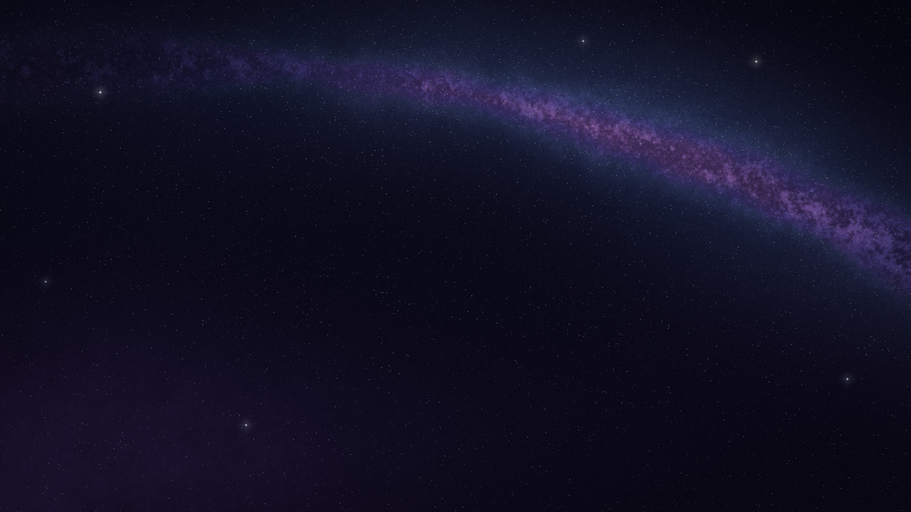

<p align="center"></p>

<h1 align="center">静页 · Quiet Tab</h1>

<p align="center"><a href="README.md">English</a> | 中文</p>

<p align="center">一个只显示<b>你自己的壁纸</b>的 Chrome 新标签页 —— <b>零权限、零脚本、不联网</b>。</p>

<p align="center"><br><sub>效果预览：使用随项目附带的示例壁纸「夜曲星场」（CC0）</sub></p>

---

## 这是什么

Chrome 自带的新标签页即使换了背景，中间也始终有 Google 标志、搜索框和几张卡片，而且 Chrome 没有提供关闭它们的选项。

这个扩展用一张你自己的图片替换整个新标签页：打开新标签页，只看到壁纸。搜索照常用顶部的地址栏。

它刻意做得很小：整个扩展只有几个文件，没有任何 JavaScript，manifest 里没有申请任何权限，页面也不会发出任何网络请求。30 秒就能把源码读完，你可以亲自确认它什么都不收集。

## 特性

- 🖼️ **只有壁纸**：没有 Google 标志、搜索框、快捷方式和卡片
- 🔒 **零权限**：`manifest.json` 里没有 `permissions` 和 `host_permissions`
- 🚫 **零脚本、零联网**：页面只有 HTML + CSS，只加载扩展文件夹里的本地文件
- 📁 **放图即用**：支持 `background.jpg`、`background.png`、`background.webp`
- 🌗 **没放图时**是一张空白页，底色跟随系统的浅色 / 深色模式
- 🔍 **搜索不受影响**：打开新标签页后直接在地址栏输入即可

## 文件结构

```
quiet-tab/
├── manifest.json        # 扩展声明：只做「替换新标签页」这一件事
├── newtab.html          # 新标签页本体（HTML + CSS）
├── favicon.svg          # 标签页图标（单色，随浅色 / 深色主题变化）
├── icons/               # 扩展管理页用的图标（16 / 48 / 128 px）
├── _locales/            # 扩展名称与描述的中英文翻译
├── samples/             # 示例壁纸（原创、CC0）及其生成脚本与设计说明
├── background.jpg       # ← 你自己放进来的壁纸（不包含在仓库中）
├── README.md            # 英文说明
└── README.zh-CN.md      # 中文说明
```

## 使用步骤

1. **下载**：点击本页面的 **Code → Download ZIP** 并解压，或者 `git clone` 本仓库。把文件夹放在一个固定的位置（加载后不要移动或删除它）。
2. **放入壁纸**：把你的图片复制进文件夹，改名为 `background.jpg`（也可以是 `background.png` 或 `background.webp`）。暂时没有合适的图？可以先把 `samples/starry-sky.jpg` 复制出来改名使用（见下方「示例壁纸」）。
3. **打开扩展页**：在 Chrome 地址栏输入 `chrome://extensions` 并回车。
4. **开启开发者模式**：打开页面右上角的「开发者模式」开关。
5. **加载扩展**：点击「加载已解压的扩展程序」，选择这个文件夹。
6. **确认生效**：按 `Ctrl + T`（macOS 为 `⌘ + T`）打开新标签页。如果 Chrome 询问「这是你想要的新标签页吗？」，选择「保留更改」。

## 更换壁纸

1. 用新图片替换文件夹里的 `background.*`（文件名保持不变）。
2. 回到 `chrome://extensions`，点击本扩展卡片上的刷新按钮（↻）。
3. 打开新标签页即可看到新壁纸。

> 同时存在多个格式时，优先级是 `webp` > `png` > `jpg`。换图时记得删掉旧格式的文件。

## 示例壁纸

`samples/starry-sky.jpg` 是本项目原创的 4K 星空壁纸（3840×2160），完全由程序生成，以 **CC0** 协议发布，可以随意使用、修改和分享。

- 构图特意让画面**中间保持暗和安静**，银河带从上方掠过，适合做新标签页背景；
- `samples/generate_starry_sky.py` 是生成脚本，随机种子固定，**任何人都能重新生成这张图**，以证明它是原创的。在相同的库版本下（本图使用 numpy 2.5.3、scipy 1.18.1、pillow 12.3.0）可以逐字节复现；换成其他版本时画面基本一致，但文件可能有细微差别。想要不同的星空，改一下里面的 `SEED` 即可；
- `samples/starry-sky.md` 是这张图的设计说明。

重新生成（需要安装 [uv](https://docs.astral.sh/uv/)）：

```bash
cd samples
uv run --with numpy --with scipy --with pillow python generate_starry_sky.py
```

## 自定义（可选）

以下都只需编辑 `newtab.html`，改完后在扩展页点刷新：

| 想调整的 | 修改位置 | 示例 |
|---|---|---|
| 窗口比例和图片不同时，保留图片的哪一部分 | `--focus` | `center`（默认）、`30% 50%`（主体在左三分之一处） |
| 没放图 / 图片加载前的底色 | `--fallback-color` | 浅色模式和深色模式各有一个值 |
| 标签页标题 | `<title>` | 默认 `New Tab`，可改为 `新标签页` |

## 隐藏底部页脚（Chrome 138 及以上）

从 Chrome 138 开始，**由扩展提供的新标签页**底部会多出一条页脚，显示扩展名称和「自定义 Chrome」按钮，并且会占用一部分画面。这是 Chrome 自己加的，扩展无法去掉，但你可以关闭它：

- 在页脚上**右键** →「**在新标签页上隐藏页脚**」；或者
- 点击右下角「**自定义 Chrome**」→ 侧边栏最底部 → 关闭「**在新标签页上显示页脚**」。

关闭后壁纸会铺满整个页面。

> ⚠️ 关闭后，这个开关在扩展提供的新标签页里就看不到了。想重新打开，请在地址栏访问 `chrome://new-tab-page`（Chrome 原版新标签页），在那里打开「自定义 Chrome」。菜单名称可能因 Chrome 版本略有不同。

## 卸载 / 恢复默认新标签页

打开 `chrome://extensions`，**关闭**或**移除**本扩展，新标签页就会立即恢复成 Chrome 默认的样子。

## 注意事项

- **需要开发者模式**：本扩展以「已解压的扩展程序」方式安装，Chrome 可能会不时提示你正在使用开发者模式的扩展，属于正常现象。
- **不要移动或删除文件夹**：Chrome 直接读取这个文件夹，移动后需要重新加载。
- **同一时间只能有一个扩展接管新标签页**：如果你装了其他新标签页扩展，通常以最后启用的那个为准，请停用其他的。
- **手机和平板不支持**：Android 和 iOS 版的 Chrome 都不支持扩展。不过它们现在都能在新标签页的「自定义」菜单里上传自己的图片当背景（Google 标志和搜索框同样无法去掉）。
- **壁纸不会跨设备同步**：图片保存在本机文件夹里，每台电脑需要各自放一份。
- **图片版权**：请只使用你有权使用的图片。如果用的是别人的作品，不要把它提交到公开仓库（本仓库的 `.gitignore` 已默认排除 `background.*`），分享截图时请注明原作者。
- **图片大小**：分辨率接近屏幕即可（4K 已经足够）。体积过大的图片可能让新标签页打开时稍有延迟。
- **其他浏览器**：Microsoft Edge、Brave 等基于 Chromium 的浏览器理论上也能使用，但未逐一测试。

## 隐私

- 不申请任何权限，无法读取你的浏览记录、标签页或网页内容。
- 页面中没有任何 JavaScript，不会执行代码，也不会发出网络请求。
- 你的壁纸只存在于你电脑上的这个文件夹里。

## 常见问题

**为什么不做成「在页面里选择图片」？**
那需要写脚本并申请存储权限，与「零权限、零脚本」的初衷冲突。换图只需替换一个文件，也足够简单。

**打开新标签页后能直接打字搜索吗？**
可以，直接在地址栏输入即可（已在 Chrome 上实测）。

**为什么图标不是 Chrome 的标志？**
Chrome 标志是 Google 的注册商标。本项目使用自己绘制的中性图标（相框、山和月亮）。

## 致谢

- 本项目在 [Claude](https://claude.com)（Anthropic）的协助下完成，包括同类项目调研、代码与文档编写，以及测试验证。
- 示例壁纸「夜曲星场 · Nocturne Field」由 Claude 设计并通过程序生成，随项目以 CC0 协议发布。

## 许可证

代码以 [MIT](LICENSE) 协议发布；示例壁纸 `samples/starry-sky.jpg` 以 CC0 协议发布。
